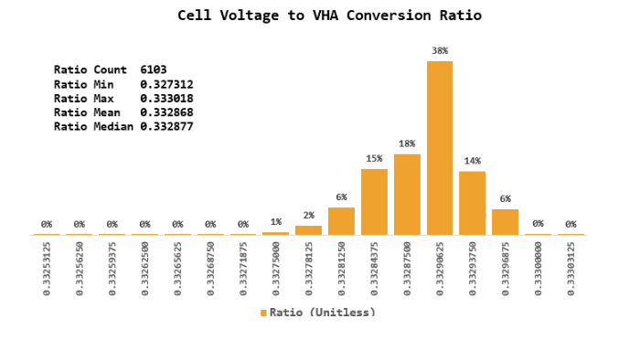

 
<h3 align=center>Coin Cells</h2>
<h4 align=center>This document looks at a manufacturing battery threshold issue.</h3>
 

#  Manufacturing Battery Threshold Calculation

Production needs to ensure that the product leaves the factory with sufficient charge that it can be:

* configured/branded in production.
* stored for 120 day
* successfully fitted during a 30 minutes clinical session.

## Introduction

This repo contains some calculation and modeling activities associated with determining a test threshold for use in production. It provides a nice illustration of Monte Carlo modeling in an engineering setting.

## Background

## Analysis

### Source of Error/Variation

The model needs to account for the following sources of variation:

* LSAD Error An A/D converter channel is connected to the hearing aid voltage (VHA). VHA is 3 &middot; VBAT.
* Ratio Error The battery voltage (VBAT) is related to VHA by the formula $V_{BAT}=3 \cdot V_{HA}$. However, the factor of 3 is not exact. 
* Battery Variation Every battery has different capacities and their VI characteristics vary with age. In production, however, all the batteries are new and they vary less. 

 ### Ratio Modeling
 
 
